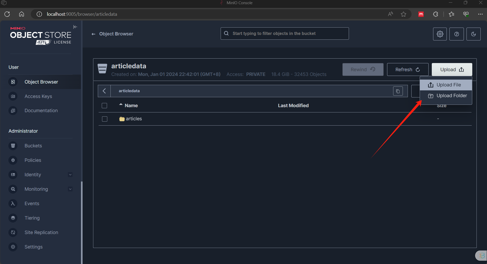

# DDBMS
Distributed Database Management System Project for THUACP2023
## Install Requirements
```bash
pip install -r requirements.txt
```

## Set Up
### 1. Database Setup
MySQL is used for database. Run the following sql statment to create the two databases
```sql
CREATE DATABASE DBMS1;
CREATE DATABASE DBMS2;
```
Then create tables and populate them with data in their respective database using sql statements provided in this project. They are located in different folders and already fragmented according to the requirements in the project. The sql statements are named with their respective dbms for example `article_dbms1.sql` in article folder for article data in `DMBS1`
-> When running a large script in mysql workbence, to bulk load the data into database, set maximum allowed 
```
 SET GLOBAL max_allowed_packet=1000000
```
 
 
### 2. MinIO 
MinIO cluster is build on docker compose. Therefore docker need to installed. To built the container change current directory to minio folder, where `docker-compose.ymal` is located, then run the following command.
```bash
$ cd minio
$ docker-compose up -d
```
This will build docker container containing four images, minio1, minio2, minio3 and ngnix
After than visit minio console interface at localhost:9005. Login using the credentials set in `docker-compose.yaml`
Then create a bucket and upload the article data



### 3. Run Flask APP

```bash
cd web
flask --app newsapp --debug run
```
